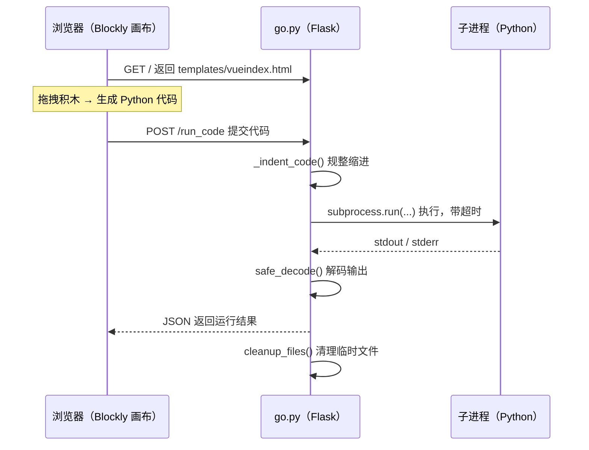
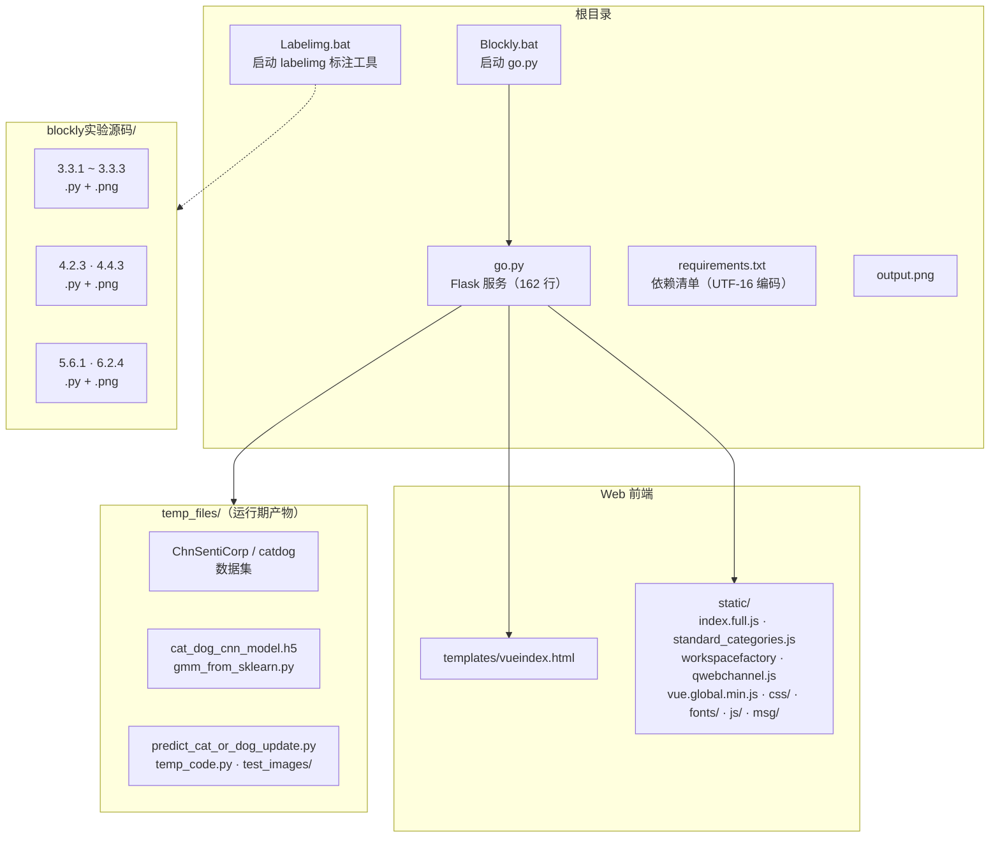
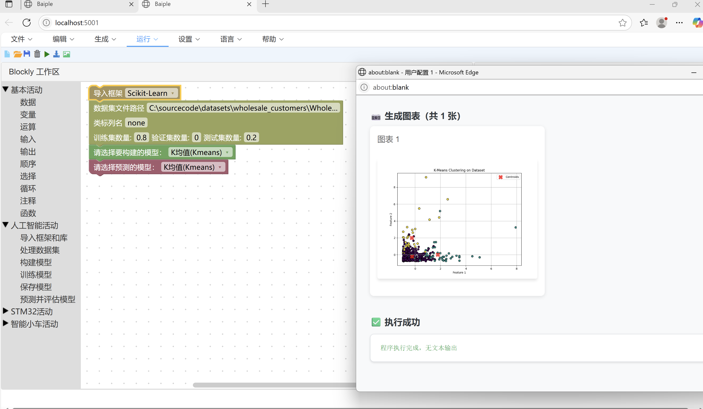
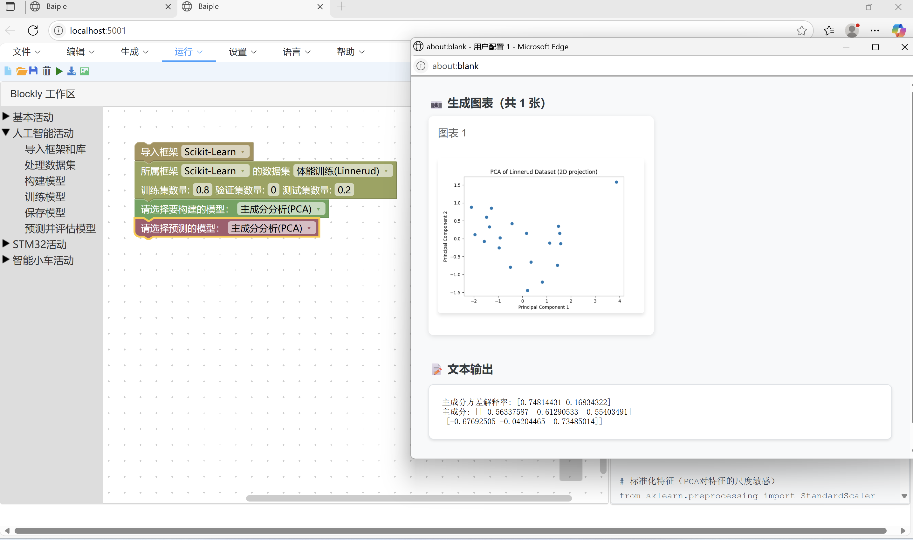
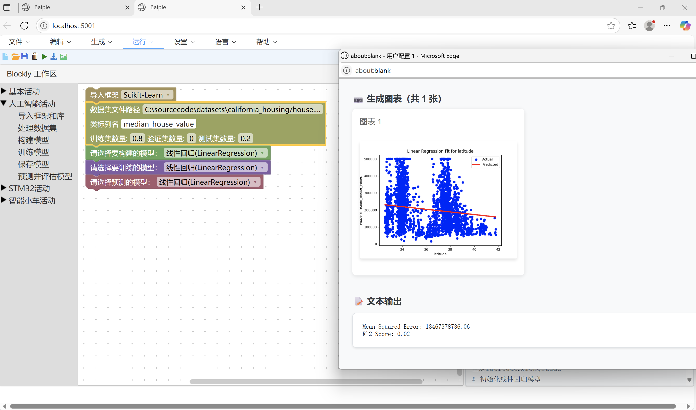
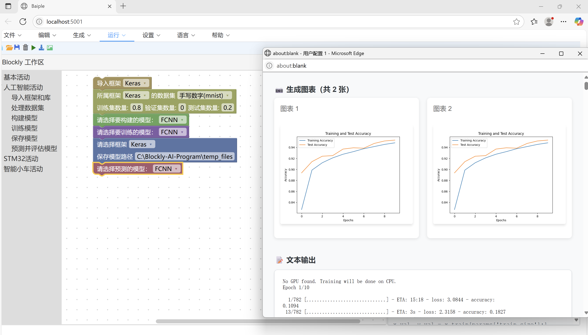
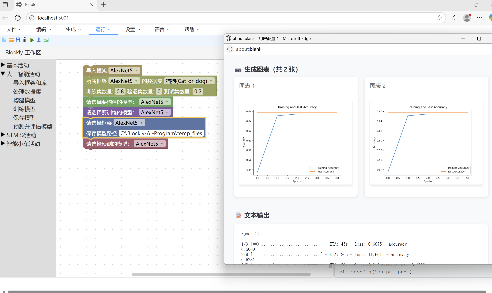
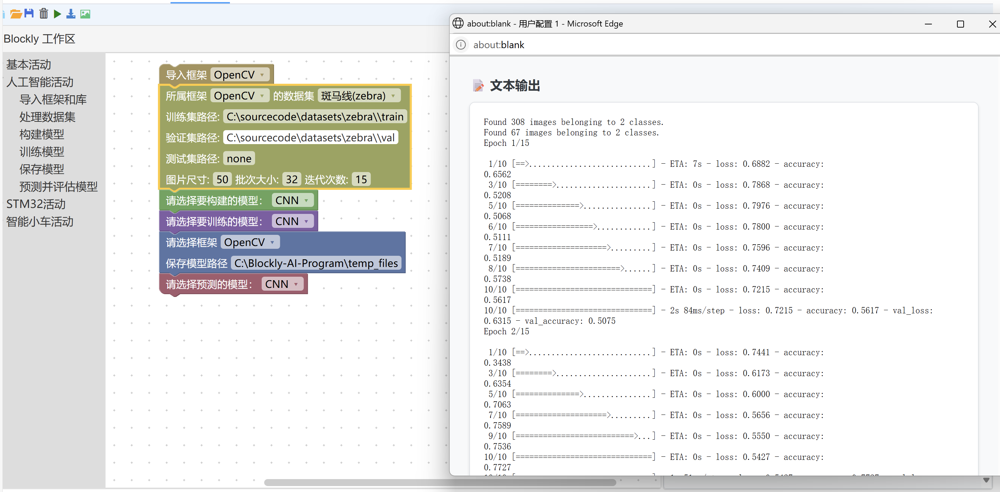
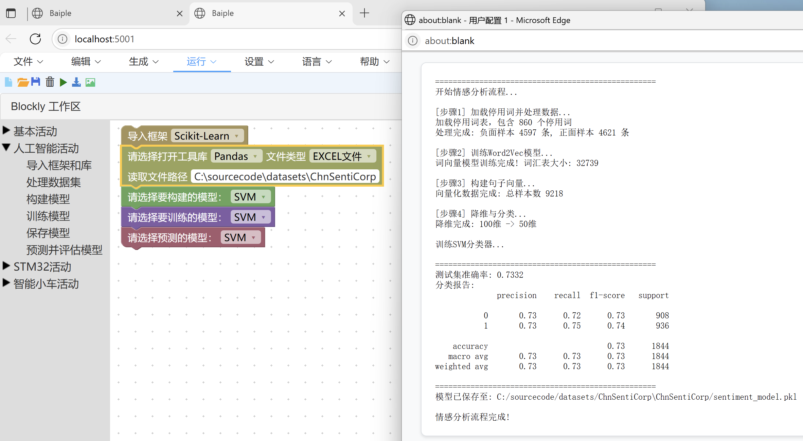

# Baiple

**基于 Blockly 的可视化机器学习实验平台** —— 用积木块拼出程序，点一下就能跑，结果直接回显在网页上。

> 配套 `Labelimg.bat` 可一并拉起标注工具，形成「标注 → 训练 → 可视化」的实验闭环。

---

## 它是怎么工作的

核心是根目录的 `go.py`（162 行，Flask 应用）：



| 路由 / 函数 | 作用 |
|---|---|
| `GET /` → `index()` | 渲染 Blockly 页面（`templates/vueindex.html`） |
| `POST /run_code` → `run_code()` | 接收前端提交的代码，`subprocess.run()` 执行并回传输出 |
| `_indent_code()` | 规整代码缩进 |
| `safe_decode()` | 兼容不同编码解码子进程输出 |
| `cleanup_files()` | 清理临时文件（注释说明是为了解决 Windows 文件占用问题） |
| `open_browser()` | 启动后自动打开浏览器 |

启动时用 `webbrowser` + `threading.Timer` 自动打开页面，配置 `MAX_CONTENT_LENGTH = 16MB`。

---

## 结构总览



---

## 目录结构

```
Baiple/
├── go.py                      # Flask 服务：接收 Blockly 代码并执行
├── requirements.txt           # 依赖清单（注意：UTF-16 编码）
├── Blockly.bat                # 启动脚本 → .venv\Scripts\python.exe go.py
├── Labelimg.bat               # 启动脚本 → labelimg.exe
├── templates/
│   └── vueindex.html          # Blockly 主页面
├── static/                    # Blockly 前端资源
│   ├── index.full.js  standard_categories.js  workspacefactory/
│   ├── qwebchannel.js  vue.global.min.js
│   ├── css/  fonts/  js/  js0/  msg/
│   ├── car.jpg  index.css
│   ├── run.bat
│   └── Blockly Demo_ Blockl_20250220_091128.txt
├── blockly实验源码/            # 实验脚本与对应截图
│   ├── 3.3.1.py / .png   3.3.2.py / .png   3.3.3.py / .png
│   ├── 4.2.3.py / .png   4.4.3.py / .png
│   └── 5.6.1.py / .png   6.2.4.py / .png（另有 6.2.5.py）
├── temp_files/                # 运行期临时文件（数据集、模型、中间脚本）
│   ├── ChnSentiCorp/  catdog/
│   ├── cat_dog_cnn_model.h5  gmm_from_sklearn.py
│   ├── predict_cat_or_dog_update.py  temp_code.py
│   ├── processed_train_records/  processed_test_records/  test_images/
│   └── Training and Test Accuracy_AlexNet_Binary.png
├── output.png
└── .idea/
```

---

## 实验脚本

`blockly实验源码/` 下每份 `.py` 都配有同名 `.png` 截图，是各实验的**代码与运行结果对照**。
已读取到的实现内容举例：

| 脚本 | 内容 |
|---|---|
| `3.3.1.py` | 用 `sklearn.cluster.KMeans` 对 Wholesale customers 数据集做聚类（6 个特征，`n_clusters=3`），`StandardScaler` 标准化后用 matplotlib 散点图可视化 |

`temp_files/` 中另有 GMM 聚类（`gmm_from_sklearn.py`）、猫狗二分类训练与推理
（`predict_cat_or_dog_update.py`）、中文情感语料 `ChnSentiCorp` 等运行期产物。

---

## 依赖

`requirements.txt` 为 **UTF-16 编码**（用普通 UTF-8 工具打开会出现字符间空格），主要包含：

| 类别 | 依赖 |
|---|---|
| Web | `Flask==3.1.1`、`flask-cors==6.0.1`、`Jinja2==3.1.6` |
| 机器学习 | `keras==2.10.0`、`h5py==3.14.0`、`scikit-learn`、`gensim==4.3.3` |
| 数据 / 中文 | `pandas`、`jieba==0.42.1`、`ChnSentiCorp` 相关 |
| 可视化 | `matplotlib`、`colorama` |

---

## 运行

`Blockly.bat` 里写死了 Windows 路径，说明原始开发环境为：

```bat
C:\Blockly-AI-Program\.venv\Scripts\python.exe C:\Blockly-AI-Program\go.py
```

**在 Linux / macOS 上运行**：

```bash
pip install -r requirements.txt
python3 go.py          # 启动后会自动打开浏览器
```

> `requirements.txt` 是 UTF-16 编码，部分工具读取会失败；可用
> `iconv -f UTF-16 -t UTF-8 requirements.txt > req_utf8.txt` 转换后再安装。

---

## 截图









---

## 已知问题

| 问题 | 说明 |
|---|---|
| **模型文件为空** | 根目录的 `BP_Mnist_model-Keras.h5` 与 `cat_dog_classification_alexnet_binary.h5` **均为 0 字节空文件**，不含任何模型权重，无法直接加载使用 |
| `Thumbs.db` | 0 字节的 Windows 缩略图缓存残留 |
| 硬编码路径 | `Blockly.bat`、`Labelimg.bat` 及实验脚本中使用了 `C:\...` 绝对路径，换机需修改 |
| `temp_files/` 已入库 | 运行期临时产物被提交进仓库，建议加入 `.gitignore` |
| `requirements.txt` 编码 | UTF-16，部分包管理工具无法直接解析 |

---

## 归属与许可证

- 本仓库**未附带 LICENSE 文件**。
- 前端 `static/` 目录为 **Google Blockly** 的构建产物与配套资源
  （`index.full.js`、`standard_categories.js`、`workspacefactory/` 等），
  Blockly 由 Google 开源，遵循 **Apache License 2.0**，相关权利归原作者所有。
- `qwebchannel.js` 来自 **Qt**（`qwebchannel.js` 为 Qt WebChannel 的 JS 实现）。
- `vue.global.min.js` 为 **Vue.js** 发行版（MIT 许可）。
- 实验脚本与 Flask 服务部分为本人编写。
- `temp_files/` 中的数据集（如 `ChnSentiCorp` 中文情感语料）版权归其原始发布方所有，
  此处仅为实验过程残留。
